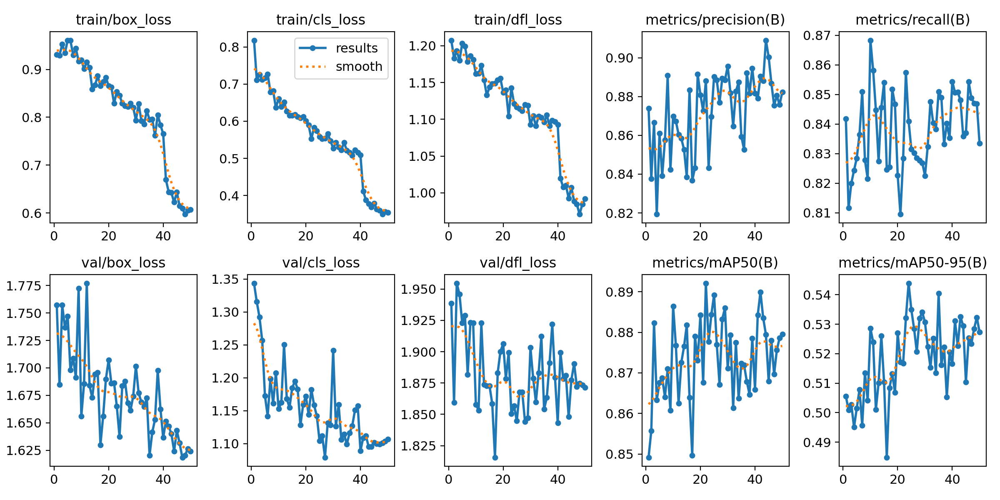
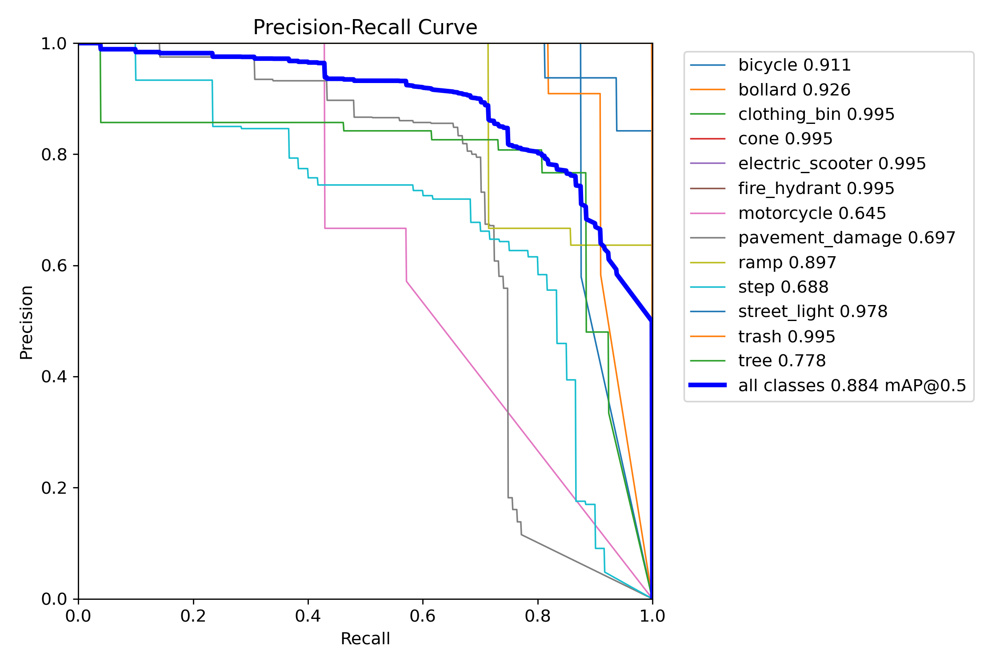
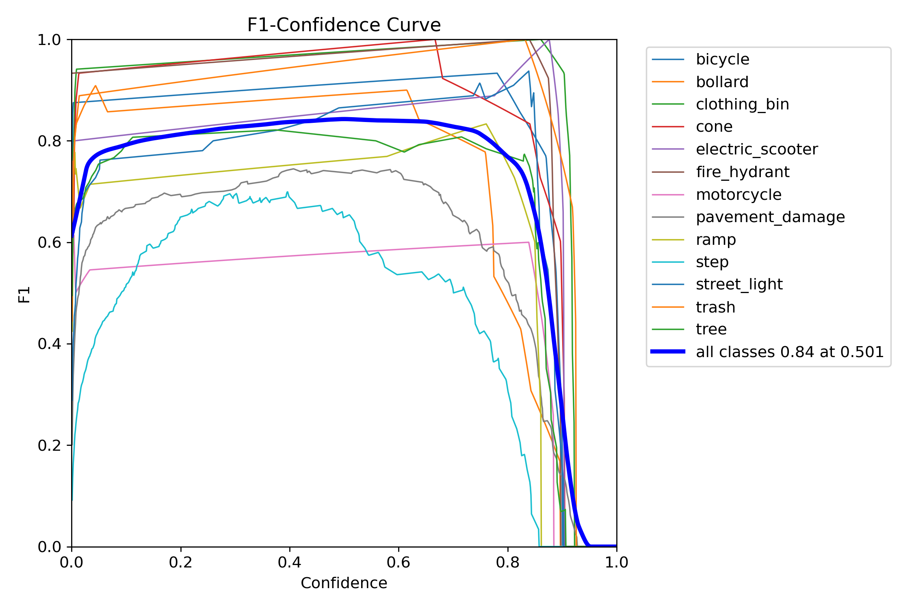
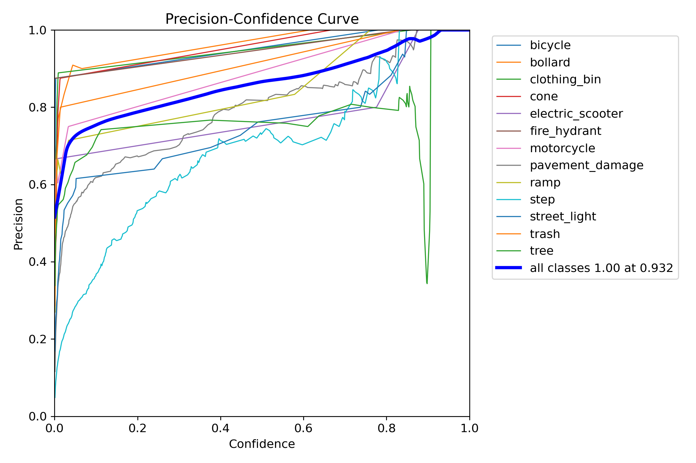
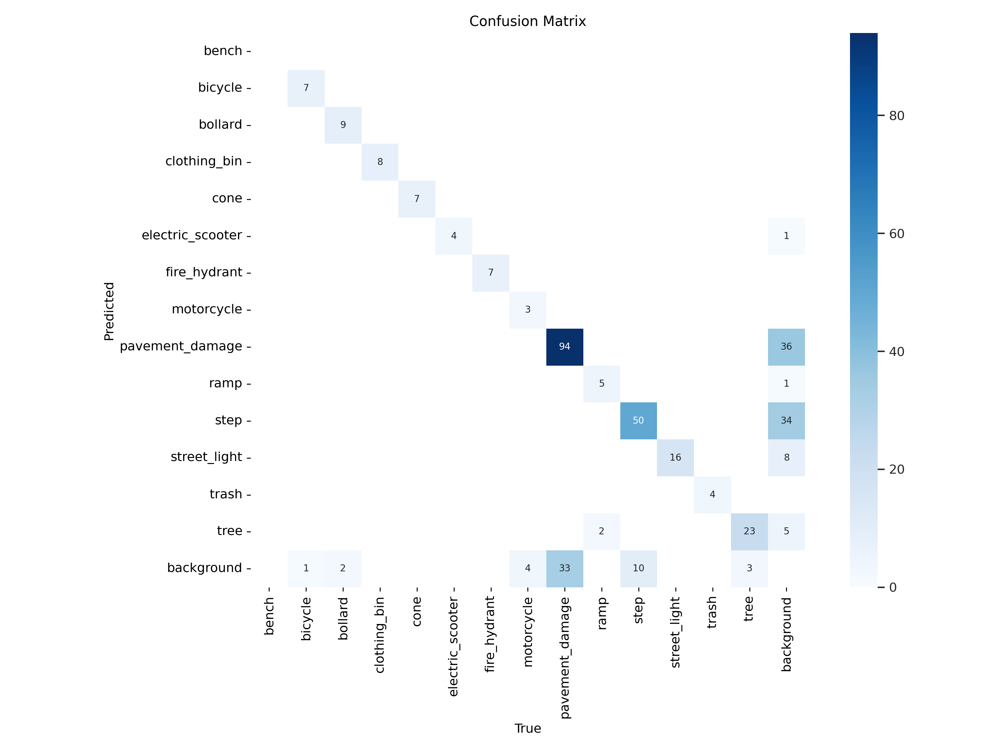
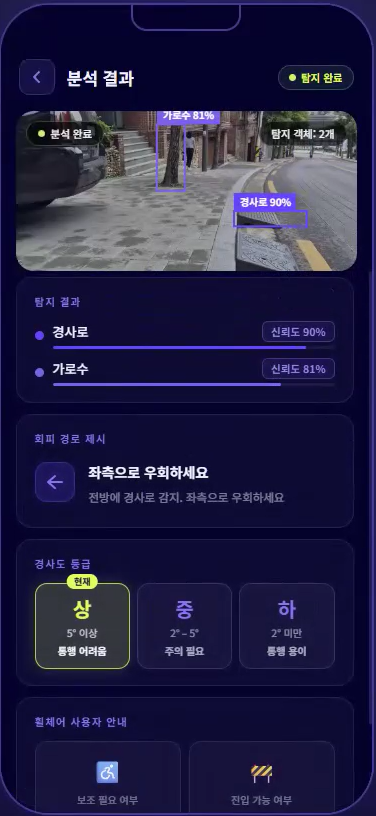
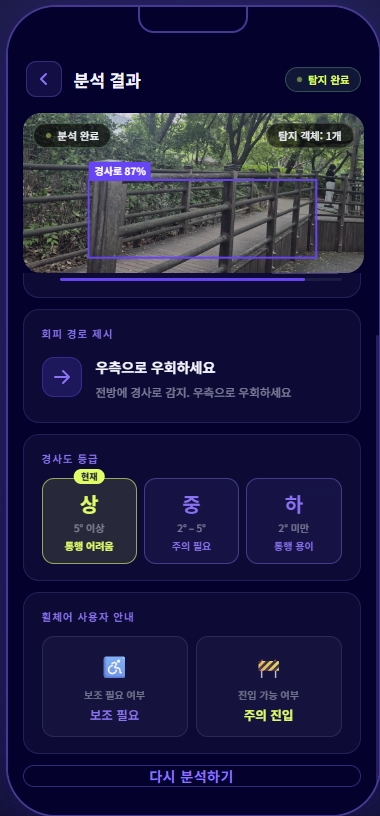
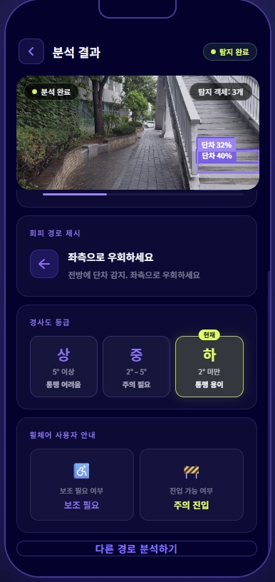
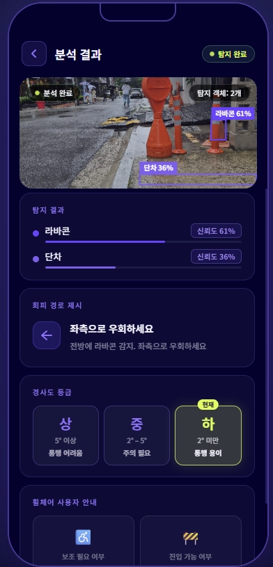

# NoonGil-BarrierFree-AI 👁️ : Barrier-Free Navigation Assistant for Wheelchair Users

> 휠체어 사용자의 보행 안전을 위한 AI 기반 장애물 탐지 및 경사도 추정 시스템

> **Team NoonGil** | 이지현(팀장) · 윤서연 · 탁예린 | Sookmyung Women's University, Seoul, Republic of Korea

---

## 📌 Project Overview

본 프로젝트는 휠체어 사용자가 보행 중 마주치는 **장애물 탐지**와 **경사도 추정**을 통해
통과 가능 여부를 실시간으로 알려주는 AI 기반 보행 안전 보조 시스템입니다.

효창공원 일대 보행로에서의 실제 경험을 바탕으로, 볼라드·전동킥보드 등 장애물로 인한
휠체어 사용자의 이동권 문제를 해결하고자 시작되었습니다.
정면 촬영된 이미지 한 장을 입력받아 장애물 탐지, 경사도 추정, 회피 경로 제시, TTS 알림까지
하나의 파이프라인으로 처리합니다.

---

## 🌍 Social Background

대한민국의 장애인 이동권 문제는 오랫동안 해결되지 않은 사회적 과제입니다.

2023년 보건복지부 통계에 따르면 국내 등록 장애인 수는 약 264만 명이며, 이 중 지체장애인은 전체의 44.3%로 가장 높은 비율을 차지합니다.

그러나 도심 보도 환경은 여전히 이들의 이동을 가로막는 구조적 장벽으로 가득합니다.
불법 주정차 오토바이, 전동킥보드·자전거 방치, 보도블록 파손, 가파른 경사로 등은 휠체어 사용자의 실질적인 이동을 위협하는 요소들입니다.

특히 이러한 장애물들은 사전에 예측하거나 우회 경로를 계획하기 어려워, 단순한 불편을 넘어 낙상 사고 및 고립으로 이어질 수 있습니다.

본 프로젝트는 효창공원 일대에서의 직접적인 현장 관찰을 계기로 시작되었습니다.
보행 환경이 충분히 정비되어 있다고 여겨지는 도심 속에서도, 휠체어 사용자가 혼자서는 안전하게 이동하기 어렵다는 현실을 목격하며 기술적 해결책의 필요성을 절감하였습니다.

> 🇺🇳 UN 장애인권리협약(CRPD) 제9조는 장애인의 물리적 환경에 대한 접근성을 기본권으로 명시하고 있으며, 대한민국 또한 2009년 이를 비준하였습니다.

NoonGil-BarrierFree-AI는 이러한 사회적 공백을 AI 기술로 메우고자 합니다.
실시간 장애물 탐지와 경사도 분석을 통해, 휠체어 사용자가 보다 안전하고 자율적으로 도시를 이동할 수 있는 환경을 만드는 것이 이 프로젝트의 궁극적인 목표입니다.

---

## 🔄 Program Pipeline

```
Data Input         : 정면 촬영 이미지 1장 입력
      ↓
Object Detection   : YOLOv12 기반 장애물 Bounding Box 좌표 추출
      ↓
Depth Estimation   : Depth Anything 기반 거리 데이터(Depth Map) 생성
      ↓
Slope Estimation   : Depth Map 기반 경사도 추정
      ↓
Integration        : 좌표 + 거리 + 경사도 값 통합 계산
      ↓
Output             : 통과 가능 여부 알림 (UI / TTS) + 회피 경로 제시
```

### 공개 데이터셋: 총 685장
- 출처: [Roboflow Universe](https://universe.roboflow.com/) 공개 데이터셋 활용
- 직접 수집 데이터와 병합 후 Augmentation 적용
  - step_new v1 (273장)
  - pothole v3 (412장)

---

## 🏗️ Model Architecture

| 모듈 | 모델 | 역할 |
|------|------|------|
| Object Detection | YOLOv12 | 장애물 탐지 및 Bounding Box 추출 |
| Depth Estimation | Depth Anything | Depth Map 생성 |
| Slope Estimation | Depth Map 기반 연산 | 경사도 추정 |

---

### ⚙️ Prerequisites

| 항목 | 내용 |
|------|------|
| **언어** | Python 3.9+ |
| **웹 프레임워크** | Flask |
| **Object Detection** | YOLOv12 |
| **Depth Estimation** | Depth Anything |
| **학습 환경** | Google Colab (GPU) |
| **실행 환경** | WSL2 + CUDA (로컬) 또는 GPU 서버 권장 |
| **데이터 관리** | Roboflow (라벨링·증강·버전 관리) |
| **버전 관리** | Git / GitHub |

> **GPU 설정 (WSL2 기준):** NVIDIA CUDA Toolkit 및 드라이버 설치 필요.
> 자세한 내용은 [NVIDIA WSL2 가이드](https://docs.nvidia.com/cuda/wsl-user-guide/) 참고.

---

## 🚀 Getting Started

### Dependencies and Installation

* [Anaconda3](https://www.anaconda.com/download)
* Python == 3.9
* NVIDIA GPU + [CUDA](https://developer.nvidia.com/cuda-downloads) (recommended)
  * For WSL2 environments, refer to the [NVIDIA WSL2 Guide](https://docs.nvidia.com/cuda/wsl-user-guide/)

**1. Create conda environment**

```bash
conda create --name noongil python=3.9
conda activate noongil
```

**2. Clone the repository**

```bash
git clone https://github.com/ezhye0n/NoonGil-BarrierFree-AI.git
cd NoonGil-BarrierFree-AI
```

**3. Install [YOLOv12](https://github.com/sunsmarterjie/yolov12)**

```bash
git clone https://github.com/sunsmarterjie/yolov12.git
cd yolov12
pip install -e .
cd ..
```

**4. Install dependencies**

```bash
pip install -r requirements.txt
```

---

### Pretrained Model

Download the pretrained weights from [**GitHub Releases**](https://github.com/ezhye0n/NoonGil-BarrierFree-AI/releases/tag/v12_no_curb_finetune) and place the file at `src/v12_no_curb_finetune_v10_best.pt`.

```
src/
└── v12_no_curb_finetune_v10_best.pt   ← place here
```

---

### Run

```bash
python src/app.py
```

Open your browser and go to `http://localhost:5000`.

---

### Testing

**Option 1 — Web UI (Recommended)**

1. Go to `http://localhost:5000`
2. Upload a front-facing sidewalk image (`.jpg` / `.png`)
3. Click **분석하기**
4. View detected obstacles with bounding boxes (class name and confidence score shown at top-left of each box), slope grade, avoidance path, and TTS alert

**Option 2 — Direct API call**

```bash
curl -X POST http://localhost:5000/analyze \
     -F "image=@test_images/sample_bollard.jpg"
```

---

### Dataset Preparation *(for training only)*

> ⚠️ **You do not need this to run the demo.** Only required if you want to retrain from scratch.

We used our own collected dataset combined with public datasets from [Roboflow Universe](https://universe.roboflow.com/).
The final preprocessed dataset (v4, YOLOv12 format) can be downloaded via the Roboflow API:

```python
pip install roboflow

from roboflow import Roboflow

rf = Roboflow(api_key="YOUR_ROBOFLOW_API_KEY")
project = rf.workspace("s-workspace-6sd3n").project("noongil-barrierfree-ai")
version = project.version(4)
dataset = version.download("yolov12")
```

> Get your API key at [roboflow.com](https://roboflow.com) → Settings → API Key.

---

## 📦 Dataset

We combined our **own collected dataset** with **public datasets** from [Roboflow Universe](https://universe.roboflow.com/).

### Collected Dataset — 892 images (train 780 / val 74 / test 38)

- **Location:** Sidewalks around Sookmyung Women's University (효창공원앞역 ~ 숙명여대 정문)
- **Viewpoint:** Frontal, from wheelchair user's eye-level (90~100cm above ground)
- **Split ratio:** Train : Val : Test = **7 : 2 : 1** (random shuffle)

| Session | Date | Condition | Details |
|---------|------|-----------|---------|
| 1st | 05.19 | Cloudy, 16:40~17:38 | Hyochang Park / Hyochang Park Stn. ~ Sookmyung rear gate — base data |
| 2nd | 05.23 | Sunny, 12:00~13:00 | 44 images — cones, bicycles, street lights, clothing bins |
| 3rd | 05.27 | Cloudy, 13:40~14:20 | 84 images — bollards, scooters, motorcycles, steps, pavement damage |
| 4th | 05.28 | Cloudy + Night, 12:00/19:00/20:30~ | 116 images — night low-light data included |

**Collection Standard:**
- Single photographer (Yun Seoyeon), same device, fixed 3:4 aspect ratio
- Auto HDR & AI enhancement: **OFF**
- Camera height: **90~100cm from ground** (wheelchair user eye-level)

### Public Datasets

| Dataset | Images |
|---------|--------|
| step_new v1 (Roboflow Universe) | 273 |
| pothole v3 (Roboflow Universe) | 412 |
| **Total** | **685** |

### Labeling Classes

| Class | Instances |
|-------|-----------|
| `electric_scooter` | 31 |
| `bicycle` | 57 |
| `motorcycle` | 31 |
| `fire_hydrant` | 12 |
| `cone` | 32 |
| `bollard` | 43 |
| `street_light` | 114 |
| `bench` | 16 |
| `trash` | 20 |
| `clothing_bin` | 16 |
| `tree` | 118 |
| `pavement_damage` | 16 |
| `step` | 50 |
| `ramp` | 28 |

> **Step ground truth (tape measure, cm):** 3, 4, 4, 4, 6, 7, 9, 10, 10, 11, 12, 12  
> **Ramp ground truth (level app, °):** 4°, 6°, 8°, 10°, 13°, 14°, 16°  
> *(Wheelchair passage threshold: step ≥ 3cm, slope ≥ 4°)*

### Data Augmentation (via Roboflow)

| Augmentation | Value | Purpose |
|--------------|-------|---------|
| Horizontal Flip | Applied | Reduce directional bias |
| Rotation | ±15° | Handle device tilt and varied road angles |
| Brightness | ±15% | Adapt to low-light and high-contrast conditions |
| Resize | Fit (Letterbox) 512×512 | Preserve aspect ratio for model input |

---

## 🤖 Model Training

- **Model:** YOLOv12 (Object Detection)
- **Environment:** Google Colab (GPU)

### Training Pipeline

| Stage | Description | Hyperparameters |
|-------|-------------|-----------------|
| Base training | Initial training on collected + public dataset | Epochs 100, Batch 16, Imgsz 640 |
| Fine-tuning | Added step_new v1 (273 images), merged and retrained | Epochs 50, Freeze 10 |

### Final Results

| Metric | Value |
|--------|-------|
| mAP@50 | **0.883** |
| mAP@50-95 | **0.544** |
| Precision | **0.872** |
| Recall | **0.840** |
| F1 Score | **0.84** (at confidence 0.501) |

### Model Zoo

Please download the pretrained weights from [**GitHub Releases**](https://github.com/ezhye0n/NoonGil-BarrierFree-AI/releases/tag/v12_no_curb_finetune) and place the file at `src/v12_no_curb_finetune_v10_best.pt`.

| Release | Model | mAP@50 | mAP@50-95 | Download |
|---------|-------|--------|-----------|----------|
| **v12_no_curb_finetune** *(Latest)* | YOLOv12s | **0.883** | **0.544** | [Download](https://github.com/ezhye0n/NoonGil-BarrierFree-AI/releases/tag/v12_no_curb_finetune) |
| v12_no_curb_ep100 | YOLOv12s | 0.855 | 0.525 | [Download](https://github.com/ezhye0n/NoonGil-BarrierFree-AI/releases/tag/v12-no-curb-ep100) |

---

## 📊 Results & Failure Analysis

### Training Metrics

| Metric | Value |
|--------|-------|
| mAP@50 | **0.883** |
| mAP@50-95 | **0.544** |
| Precision | **0.872** |
| Recall | **0.840** |
| F1 Score | **0.84** (at confidence 0.501) |

*Evaluated on 178 validation images across all classes.*

### Per-Class AP (mAP@50)

| Class | AP@50 | Note |
|-------|-------|------|
| `clothing_bin` | 0.995 | |
| `cone` | 0.995 | |
| `electric_scooter` | 0.995 | |
| `fire_hydrant` | 0.995 | |
| `trash` | 0.995 | |
| `street_light` | 0.978 | |
| `bollard` | 0.926 | |
| `bicycle` | 0.911 | |
| `ramp` | 0.897 | ↑ +0.280 after fine-tuning (0.617 → 0.897) |
| `tree` | 0.778 | |
| `pavement_damage` | 0.697 | |
| `step` | 0.675 | ↑ +0.143 after fine-tuning (0.532 → 0.675) |
| `motorcycle` | 0.645 | Finalized as-is (see Failure Analysis) |

### Slope Estimation Logic

경사도 추정은 3가지 방법 중 max 값을 채택하는 방식으로 개선되었습니다.

| Method | Grade: 상 (≥5°) | Grade: 중 (≥2°) |
|--------|----------------|----------------|
| Method 1: Pinhole camera model angle | angle ≥ 5.0° | angle ≥ 2.0° |
| Method 2: Depth ratio | ratio ≥ 1.4 | ratio ≥ 1.15 |
| Method 3: BBox vertical ratio | ratio ≥ 0.4 | ratio ≥ 0.25 |

### Training Curves



All three training losses (box, cls, dfl) show consistent downward trends. Validation losses also decrease steadily, with mAP@50 stabilizing around **0.87~0.89** and mAP@50-95 around **0.54**.

### Precision-Recall Curve



Overall **mAP@0.5 = 0.883**. Most classes achieve high precision across the full recall range. `step` and `motorcycle` show relatively lower area under curve.

### F1-Confidence Curve



Best F1 score of **0.84** is achieved at confidence threshold **0.501**, which is used as the default inference threshold.

### Precision-Confidence Curve



### Confusion Matrix



### Failure Analysis

| Target | Issue | Root Cause | Decision |
|--------|-------|------------|----------|
| `motorcycle` | Low AP (0.645), no improvement planned | Only 31 training instances; most peripheral to core wheelchair-safety use case | **Finalized as-is** — not a primary obstacle for wheelchair users |
| `step` / `background` | Background misclassified as `step` (10 cases) | Ambiguous boundary regions in low-contrast ground textures | Refine bounding box annotation standards in future iterations |
| Slope grade (중 → 상) | Gentle slopes (2°~5°) occasionally over-estimated as 상 | 3-method max strategy can amplify outlier estimates on mild gradients | Remaining known limitation; under-estimation preferred over over-estimation for safety |

### Detection Success Cases

| Case | Description |
|------|-------------|
|  | **경사로 + 가로수 탐지** — 경사로(90%), 가로수(81%) 동시 탐지. 경사도 등급 **상(5° 이상)** 판정, 좌측 우회 안내 |
|  | **경사로 탐지** — 경사로(87%) 탐지. 경사도 등급 **상** 판정, 우측 우회 안내. 보조 필요 / 주의 진입 경고 |
|  | **단차 복수 탐지** — 단차(32%, 40%) 2개 탐지. 경사도 등급 **하(2° 미만)** 판정, 좌측 우회 안내 |
|  | **라바콘 + 단차 탐지** — 라바콘(61%), 단차(36%) 탐지. 경사도 등급 **하** 판정, 좌측 우회 안내 |

---

## 📁 Project Structure

```
NoonGil-BarrierFree-AI/
├── .github/
├── data/
├── docs/
├── frontend/
├── model/
├── noongil/
├── results/
├── src/
│   ├── app.py                              # Flask web server (entry point)
│   ├── main.py                             # Pipeline entry point
│   ├── avoid.py                            # Avoidance path logic
│   ├── depth_inference.py                  # Depth Anything inference
│   ├── slope.py                            # Slope estimation
│   ├── output.py                           # Result output
│   ├── tts.py                              # TTS alert
│   ├── test_pipeline.py                    # Pipeline test script
│   ├── test_result.json                    # Test output sample
│   └── v12_no_curb_finetune_v10_best.pt    # Pretrained weights
├── results/
│   ├── metrics/                            # Training graphs (PR curve, F1 curve, confusion matrix, etc.)
│   ├── output_images/                      # Detection success case screenshots
│   ├── failure_cases/
│   ├── test_results/
│   └── .gitkeep
├── .gitignore
├── requirements.txt
└── README.md
```

---

## 📜 License

```
MIT License

Copyright (c) 2025 Team NoonGil
(이지현, 윤서연, 탁예린 — 숙명여자대학교)

Permission is hereby granted, free of charge, to any person obtaining a copy
of this software and associated documentation files (the "Software"), to deal
in the Software without restriction, including without limitation the rights
to use, copy, modify, merge, publish, distribute, sublicense, and/or sell
copies of the Software, and to permit persons to whom the Software is
furnished to do so, subject to the following conditions:

The above copyright notice and this permission notice shall be included in all
copies or substantial portions of the Software.

THE SOFTWARE IS PROVIDED "AS IS", WITHOUT WARRANTY OF ANY KIND, EXPRESS OR
IMPLIED, INCLUDING BUT NOT LIMITED TO THE WARRANTIES OF MERCHANTABILITY,
FITNESS FOR A PARTICULAR PURPOSE AND NONINFRINGEMENT. IN NO EVENT SHALL THE
AUTHORS OR COPYRIGHT HOLDERS BE LIABLE FOR ANY CLAIM, DAMAGES OR OTHER
LIABILITY, WHETHER IN AN ACTION OF CONTRACT, TORT OR OTHERWISE, ARISING FROM,
OUT OF OR IN CONNECTION WITH THE SOFTWARE OR THE USE OR OTHER DEALINGS IN THE
SOFTWARE.
```

> **외부 라이브러리 라이센스:**
> - YOLOv12: [GPL-3.0](https://github.com/sunsmarterjie/yolov12/blob/main/LICENSE)
> - Depth Anything: [Apache 2.0](https://github.com/LiheYoung/Depth-Anything/blob/main/LICENSE)
> - Flask: [BSD-3-Clause](https://flask.palletsprojects.com/en/stable/license/)